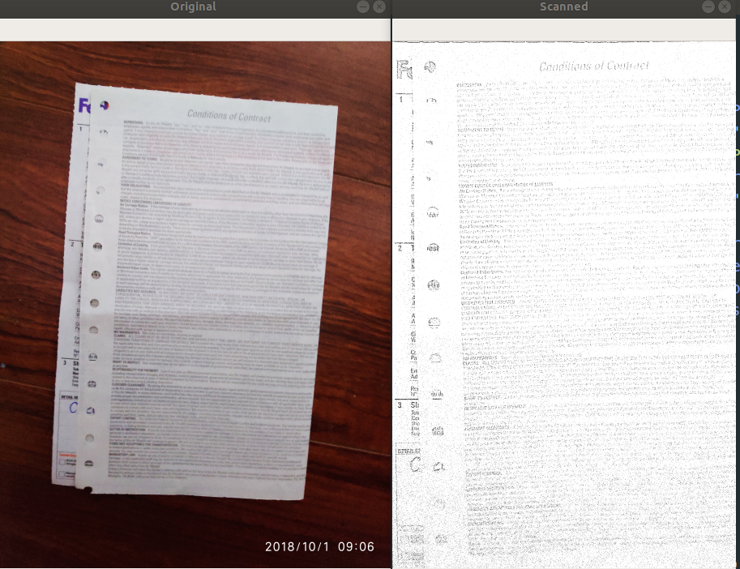

# Doc Scanner

Scan the document in a photo. Followed the tutorial [How to Build a Kick-Ass Mobile Document Scanner in Just 5 Minutes](https://www.pyimagesearch.com/2014/09/01/build-kick-ass-mobile-document-scanner-just-5-minutes/)

The application has large limit that the background should be very simple, and very different (color) from the document you want to scan.

## Demo



## Requirements

scikit-image

imutils

opencv (can be installed using `pip install opencv-contrib-python`)

## Run
```
python scanner.py -i "<img_path>"
```